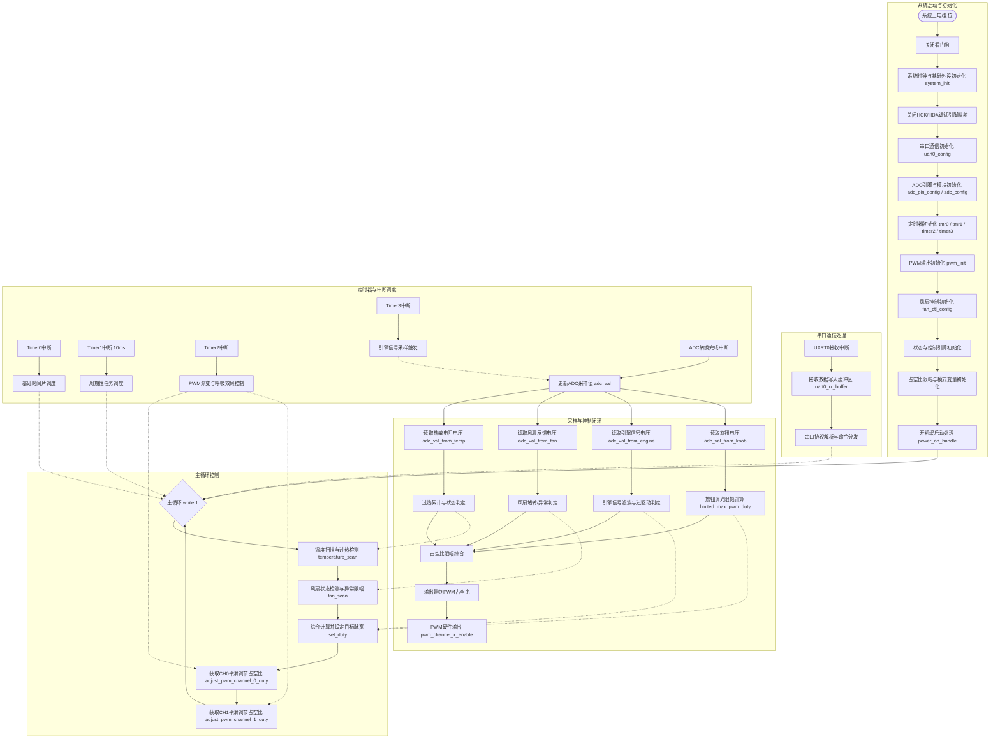

| 引脚编号 | 引脚     | 功能                                | 说明 |
| -------- | -------- | ----------------------------------- | ---- |
| 1        | P13      | 检测风扇工作状态是否异常            |      |
| 2        | P12      | 控制风扇开关                        |      |
| 3        | P11      | NC                                  |      |
| 4        | P00      | DEBUG 打印引脚                      |      |
| 5        | P02      | NC                                  |      |
| 6        | P03      | NC（暂定为串口信号接收脚）          |      |
| 7        | P31  HCK | 检测旋钮调光                        |      |
| 8        | P30      | 检测热敏电阻一侧的电压 温度检测引脚 |      |
| 9        | P27      | 检测发动机是否稳定                  |      |
| 10       | P21      | NC                                  |      |
| 11       | P17 HDA  | NC                                  |      |
| 12       | VSS      |                                     |      |
| 13       | VCC      |                                     |      |
| 14       | P16      | PWM输出，控制一路灯光（PWM1，蓝光） |      |
| 15       | P15      | PWM输出，控制一路灯光（PWM2，绿光） |      |
| 16       | P14      | 目前固定输出低电平                  |      |

demo板上可用的引脚：
| 引脚 |     | 功能                                   |
| ---- | --- | -------------------------------------- |
| P26  |     | 配置为输出模式，在逻辑分析仪上看IO翻转 |
| P25  |     | （暂定为串口信号接收脚）               |
| P24  |     |                                        |
| P23  |     |                                        |
| P22  |     |                                        |
| P21  |     |                                        |
| P17  | HDA |                                        |
| P16  |     |                                        |
| -    |     |                                        |
| P27  |     |                                        |
| P30  |     |                                        |
| P31  | HCK |                                        |
| P02  |     |                                        |
| P01  |     |                                        |
| P00  |     | DEBUG 打印引脚                         |
| P05  |     |                                        |
| P06  |     |                                        |
| P13  |     |                                        |
| P14  |     |                                        |

